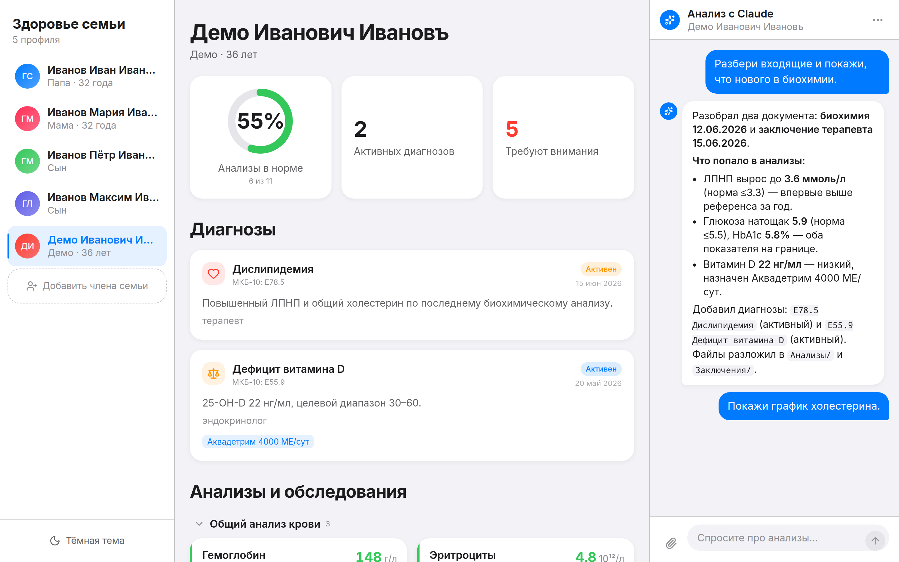

# family-health

**English** | [Русский](README.ru.md)

A self-hosted family health dashboard driven by [Claude Code](https://docs.anthropic.com/en/docs/claude-code) as the on-device assistant. One folder per family: labs, diagnoses, discharges, imaging. Data lives in JSON and plain folders on your disk — no cloud, no database. Runs on your Claude Code subscription (OAuth via the CLI), no API keys required.



Apple Health–inspired UI (dark/light, Russian by default). Drop a PDF into the browser and the agent files it, extracts labs, updates diagnoses, and renders a report widget in the chat.

## Features

- **Family view** — one card per person on the left; add new members from the UI. Each member has their own folder with `labs.json`, `diagnoses.json`, `metrics.json`, `documents.json` and category subfolders (`Анализы`, `Заключения`, `Выписки`, `Снимки`, `_inbox`).
- **Dashboard** — active diagnoses, recent labs grouped by canonical panels (CBC, biochem, lipid profile, hormones, vitamins…), metric trends (weight, glucose, BP), documents with drag-and-drop upload.
- **Chat with your data** — right-hand panel; the agent reads the active member's folder, answers questions about labs, generates reports, files new documents. Widgets stream in as `SummaryCard`, `TrendChartCard`, `ReportCard`.
- **Structured output only** — the agent talks to the browser exclusively through the `health-ui` MCP server (`emit_message`, `emit_widget`, `add_lab_results`, `save_diagnosis`, `file_document`, `update_member_json`, `run_finished`). The Claude terminal is never scraped.
- **Session reuse** — one persistent tmux session (`health`) with `claude` runs in the background; each request is a `send-keys` into that REPL. No cold-start per message.
- **Local storage only** — everything lives in `data/`. The only outbound traffic is Claude Code's normal LLM calls under your subscription.

## Architecture

```
Browser ──POST /api/chat──▶ Next.js ──tmux send-keys──▶ [tmux "health": claude REPL]
                                                            │  MCP tools (health-ui)
                                                            ▼
Browser ◀──SSE /api/events── Next.js ◀──POST /api/ingest── health-ui MCP server

web/                Next.js 15 (App Router) + React 19 + Tailwind + recharts
  src/app/api/        chat, ingest, events (SSE), upload, members, auth
  src/components/     Sidebar, Dashboard, ChatPanel, widgets/, LabGroup, ...
  src/lib/tmux.ts     send-keys wrapper around the "health" tmux session
mcp/                health-ui MCP server (stdio, TypeScript via tsx)
  src/index.ts        the seven tools listed above
runtime/            start-claude.sh: idempotently boots the tmux session
data.example/       skeleton to copy to data/ on first run
```

Personal data (`data/`) and env (`web/.env.local`) are gitignored — see `data.example/` for the layout.

## Working with the chat

The chat panel is the primary way to interact with the agent. Everything you type is prefixed on the way to Claude with `[conv:<id>][run:<id>][member:<memberId>]`, so the agent always knows which family member's folder to read.

**What you can ask.** Questions about labs (`"объясни ферритин 12, это норма?"`, `"когда последний раз сдавали ТТГ?"`), trends (`"покажи вес за последний год"`, `"как менялось давление?"`), diagnoses (`"что у меня из активного?"`, `"когда пересдать глюкозу?"`), or a full report (`"собери отчёт по последнему визиту к терапевту"`).

**How answers appear.** The agent replies via one or more streamed events, in order:
- text messages (`emit_message`) rendered as Markdown;
- widgets (`emit_widget`) — `SummaryCard` for a bullet-list summary, `TrendChartCard` for a line/area chart, `ReportCard` for a structured multi-section report;
- data-mutation tool calls (`add_lab_results`, `save_diagnosis`, `file_document`, `update_member_json`) — the dashboard reloads on their side, so you see new labs/diagnoses appear immediately in the center column.

The turn ends with `run_finished`, which unlocks the input.

**Uploading documents.** Drag a PDF/JPG onto the documents area (or the whole page) and it lands in `data/<memberId>/_inbox/`. Then ask the agent `"разбери входящие"` — it reads each file, extracts labs/diagnoses, files the document into the right category (`Анализы` / `Заключения` / `Выписки` / `Снимки`), updates the JSON, and reports back with widgets. If it can't tell what a file is (photo, screenshot), it moves it to `_media/` and leaves it alone.

**History.** Every conversation is persisted to `data/<memberId>/chat.json` — resume by refreshing the page. Each member has their own thread; switching a member in the sidebar switches the transcript. Delete a message via the chat UI to drop it from the file too.

**Switching members.** The sidebar always dictates the active `memberId`. Ask something without switching first and the agent will answer about whoever is highlighted — including for kids, spouse, etc.

**Voice.** If your browser supports the Web Speech API and the language is set to Russian (the UI is RU by default), the microphone button transcribes voice input into the chat box. No server-side ASR is bundled — everything happens in the browser.

**Tips.**
- Ask for a specific format: `"выведи табличкой"`, `"дай график"`, `"summary в трёх пунктах"`.
- Combine actions: `"разбери входящие и обнови диагнозы, потом собери отчёт"` — the agent processes them sequentially in one turn.
- If a widget looks off, just ask: `"перерисуй график только за 2026"`.
- Rename or move a member's folder → refresh; `family.json` is the source of truth for the sidebar.

## Quick start

Requirements: Node.js 20+, tmux, [Claude Code CLI](https://docs.anthropic.com/en/docs/claude-code) authenticated (`claude` in `$PATH`, OAuth done), pm2 optional for production.

```bash
git clone git@github.com:dailysergey/family-health.git && cd family-health

cp web/.env.example web/.env.local
# edit: HEALTH_DATA_DIR, HEALTH_PIN, HEALTH_INGEST_SECRET
(cd web && npm install && npm run build)
(cd mcp && npm install)

cp -r data.example data
# make HEALTH_INGEST_SECRET in web/.env.local match data/.mcp.json

bash runtime/start-claude.sh       # tmux new-session -d -s health "claude ..."
cd web && PORT=3100 npm start      # or: pm2 start ecosystem.config.js
```

Open <http://localhost:3100>, log in with the PIN from `web/.env.local`.

### Environment variables (`web/.env.local`)

| Variable | Default | Purpose |
|---|---|---|
| `HEALTH_DATA_DIR` | — | absolute path to the family data folder |
| `HEALTH_TMUX_SESSION` | `health` | tmux session name driving Claude |
| `HEALTH_INGEST_SECRET` | — | shared secret for `/api/ingest` (must match `data/.mcp.json`) |
| `HEALTH_PIN` | — | web-login PIN |
| `HEALTH_START_SCRIPT` | `./runtime/start-claude.sh` | script that boots the tmux session |

## Safety

Claude runs with `--dangerously-skip-permissions` so it can autonomously read files, move documents between folders, and call MCP tools without prompting. Only run this on a trusted machine, don't expose the tmux socket, and put a real auth layer (basic-auth / OIDC) in front of `PORT=3100` if you publish it. The PIN is a minimal check, not a replacement for proper auth.

Nothing here is a substitute for a doctor — the assistant helps you make sense of labs, not diagnose.

## License

MIT
